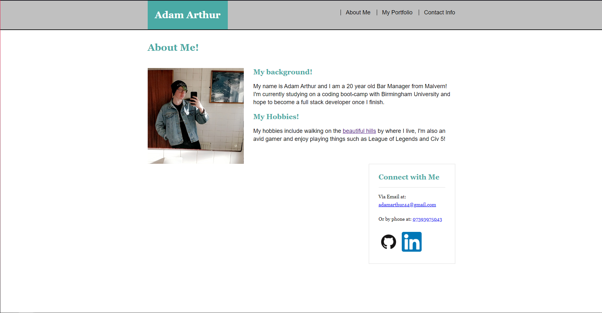
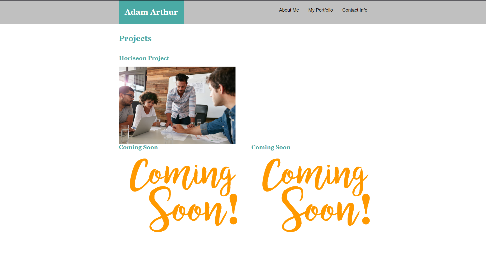

# Portfolio Project

## Project Link

Click [here](https://kingarthur0877.github.io/homework_2/.) to view my project.

## Description

For this task we were asked to create a basic Portfolio and homepage!

## What did we do?

- Created a basic About Me Page
- Added a nav bar to other pages
- Made sure to include Flex Elements
- 

## Screenshots

### About Me Page

### Portfolio Page

## Link to Deployed Application
https://kingarthur0877.github.io/homework_2/